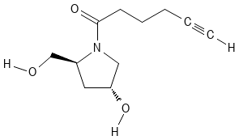

# AKL-3' — alkyne-modified solid support

1. **Name IUPAC:** 1-(hept-6-ynoyl)-4-hydroxy-L-prolinol

2. **Uses:** Introduction of a terminal alkyne group during
solid-phase oligonucleotide synthesis.

3. **Molecular formula:** C12H19NO3

4. **SMILES:** `[C@H]1(C[C@H](CN1C(CCCC#C[H])=O)O[H])CO[H]`

5. **Molecular weight:** 225.28 g/mol

6. **CAS number:** Not available

7. **Picture:**

## Structural model used for computation

The computational model represents the linker and terminal alkyne
group retained in the oligonucleotide after cleavage from the solid support.
The polymeric CPG matrix is not included.

## Source

- Manufacturer: lumiprobe
- Product name: Alkyne amidite, hydroxyprolinol
- Product page or document: https://www.lumiprobe.com/p/alkyne-amidite-pro

## Notes

The complete CPG material is a solid support rather than a single
well-defined small molecule. Therefore, CAS number may not be 
applicable to the complete material.
