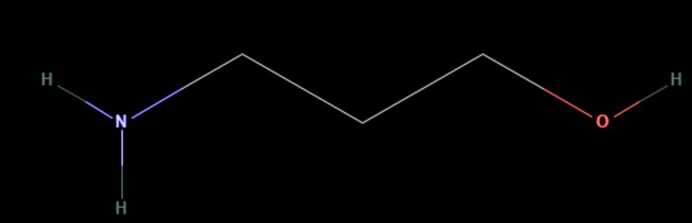

# NPO — 3-Amino-1-propanol

1. **Name IUPAC:** 3-aminopropan-1-ol

2. **Uses:** 3'-amino modifier

3. **Molecular formula:** C3H9NO

4. **SMILES:** `C(CN)CO`

5. **Molecular weight:** 75.11 g/mol

6. **CAS number:** 156-87-6

7. **Picture:**

## Source

- Chemical name, formula, molecular weight, SMILES and CAS number:
  PubChem or supplier documentation.

## Notes

- SMILES status: unverified.
- The structure should be checked computationally with RDKit.
- The displayed image is stored in `data/raw/structures/`.
