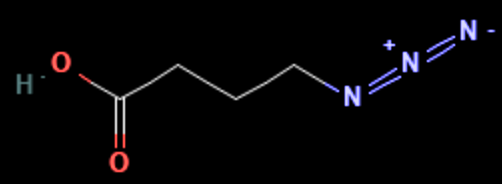

# AZB — 4-azidobutanoic acid

1. **Name IUPAC:** 4-azidobutanoic acid

2. **Uses:** Modification of an amino group to an azide group.

3. **Molecular formula:** C4H7N3O2

4. **SMILES:** `C(CC(=O)O)CN=[N+]=[N-]`

5. **Molecular weight:** 129.12 g/mol

6. **CAS number:** 54447-68-6

7. **Picture:**

## Source

- Chemical name, formula, molecular weight, SMILES and CAS number:
  PubChem or supplier documentation.

## Notes

- SMILES status: unverified.
- The structure should be checked computationally with RDKit.
- The displayed image is stored in `data/raw/structures/`.
