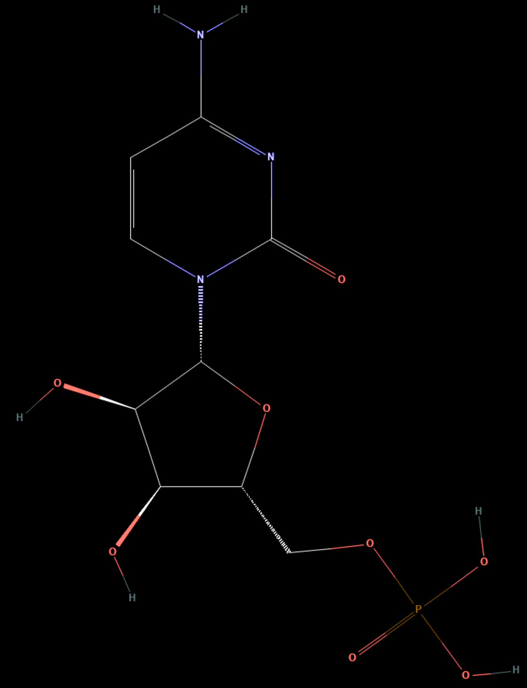

# CMP — Cytidine 5′-monophosphate

1. **Name IUPAC:** Cytidine 5′-monophosphate

2. **Abbreviation:** CMP

3. **Role:** Canonical RNA ribonucleotide monomer model; cytosine-containing
ribonucleoside 5′-monophosphate.

4. **Nucleobase:** Cytosine

5. **Molecular formula:** C9H14N3O8P

6. **SMILES:**
`C1=CN(C(=O)N=C1N)[C@H]2[C@@H]([C@@H]([C@H](O2)COP(=O)(O)O)O)O`

7. **Molecular weight:** 323.20 g/mol

8. **CAS number:** 63-37-6

9. **PubChem CID:** 6131

10. **Picture:**

## Source

- [PubChem: Cytidine monophosphate](https://pubchem.ncbi.nlm.nih.gov/compound/cytidine%20monophosphate)

## Notes

- This record represents the free 5′-monophosphate acid form.
- In an RNA strand, the nucleotide is incorporated as a phosphodiester-linked residue.
- This is not an RNA phosphoramidite used in solid-phase synthesis.
