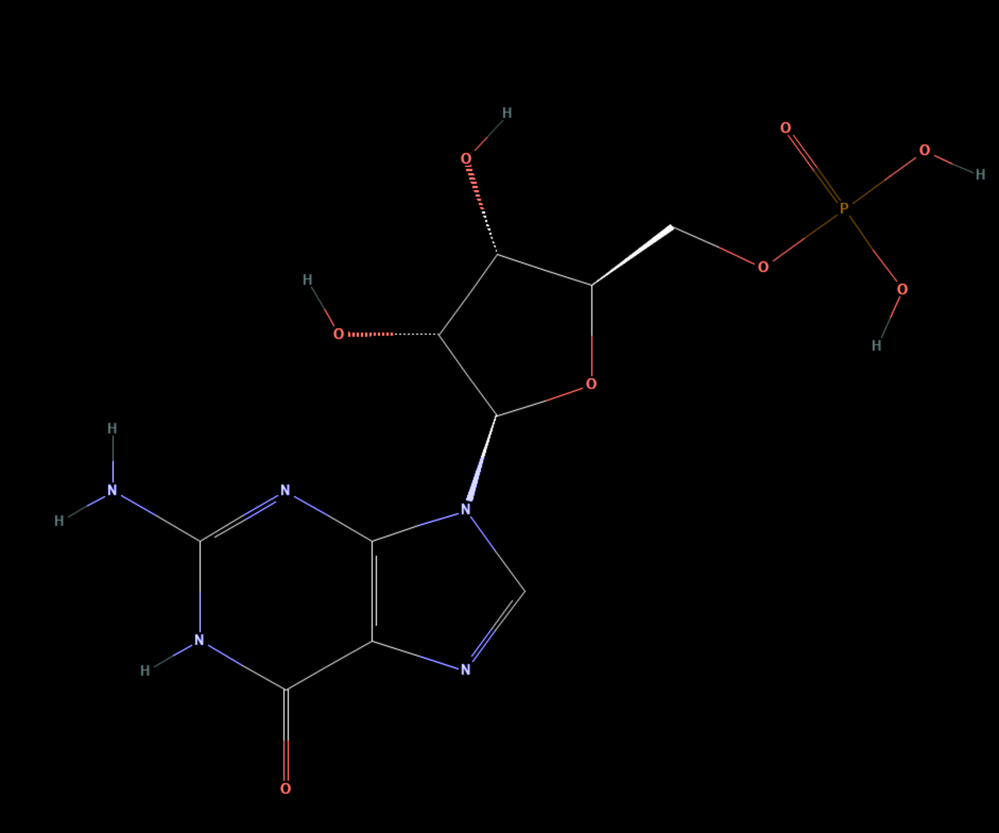

# GMP — Guanosine 5′-monophosphate

1. **Name IUPAC:** Guanosine 5′-monophosphate

2. **Abbreviation:** GMP

3. **Role:** Canonical RNA ribonucleotide monomer model; guanine-containing
ribonucleoside 5′-monophosphate.

4. **Nucleobase:** Guanine

5. **Molecular formula:** C10H14N5O8P

6. **SMILES:**
`C1=NC2=C(N1[C@H]3[C@@H]([C@@H]([C@H](O3)COP(=O)(O)O)O)O)N=C(NC2=O)N`

7. **Molecular weight:** 363.22 g/mol

8. **CAS number:** 85-32-5

9. **PubChem CID:** 135398631

10. **Picture:**

## Source

- [PubChem: Guanosine Monophosphate](https://pubchem.ncbi.nlm.nih.gov/compound/Guanosine-Monophosphate)

## Notes

- This record represents the free 5′-monophosphate acid form.
- In an RNA strand, the nucleotide is incorporated as a phosphodiester-linked residue.
- This is not an RNA phosphoramidite used in solid-phase synthesis.
