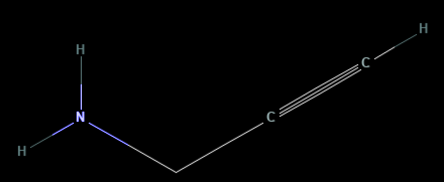

# PGA_001 — Propargylamine

1. **Name IUPAC:** prop-2-yn-1-amine

2. **Uses:** Attachment of an alkyne via an amino group.

3. **Molecular formula:** 	C3H5N

4. **SMILES:** `C#CCN`

5. **Molecular weight:** 55.08 g/mol

6. **CAS number:** 2450-71-7

7. **Picture:**

## Source

- Chemical name, formula, molecular weight, SMILES and CAS number:
  PubChem or supplier documentation.

## Notes

- SMILES status: unverified.
- The structure should be checked computationally with RDKit.
- The displayed image is stored in `data/raw/structures/`.
