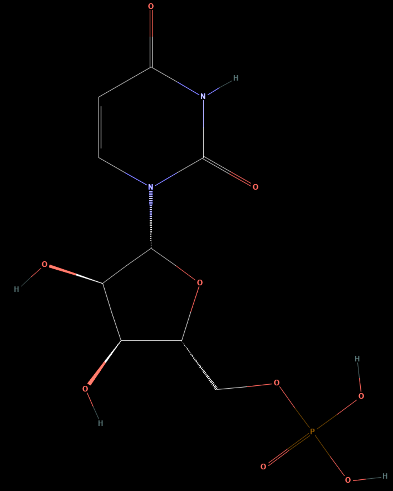

# UMP — Uridine 5′-monophosphate

1. **Name IUPAC:** Uridine 5′-monophosphate

2. **Abbreviation:** UMP

3. **Role:** Canonical RNA ribonucleotide monomer model; uracil-containing
ribonucleoside 5′-monophosphate.

4. **Nucleobase:** Uracil

5. **Molecular formula:** C9H13N2O9P

6. **SMILES:**
`C1=CN(C(=O)NC1=O)[C@H]2[C@@H]([C@@H]([C@H](O2)COP(=O)(O)O)O)O`

7. **Molecular weight:** 324.18 g/mol

8. **CAS number:** 58-97-9

9. **PubChem CID:** 6030

10. **Picture:**

## Source

- [PubChem: Uridine Monophosphate](https://pubchem.ncbi.nlm.nih.gov/compound/6030)

## Notes

- This record represents the free 5′-monophosphate acid form.
- In an RNA strand, the nucleotide is incorporated as a phosphodiester-linked residue.
- This is not an RNA phosphoramidite used in solid-phase synthesis.
